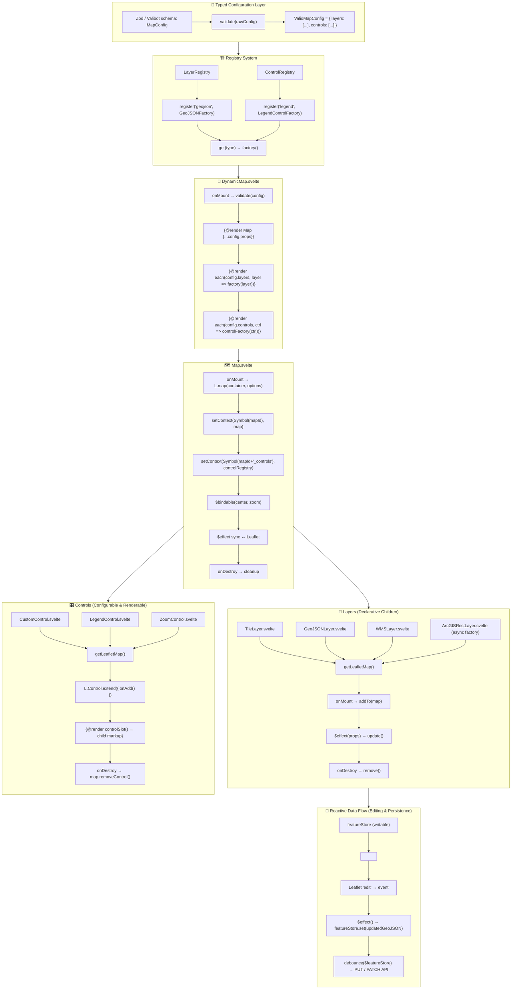

# Rationale

A clean, composable, and typed way to initialize Leaflet map logic in Svelte, while keeping `Map.svelte` small and testable.

## Basic Map Component

Move all the browser-only setup (dynamic imports, layer registry, context setup, etc.) into a helper module called `createLeafletMap.ts`.

### Step 1 — Create src/lib/map/createLeafletMap.ts
This helper handles:
- dynamic import of leaflet (SSR-safe)
- layer registry state
- typed API: registerLayer, unregisterLayer, updateLayer
- setting the MapContext

### Step 2 — Simplify Map.svelte
Now the component is minimal and purely declarative.
- No Leaflet import here, so SSR never fails.
- The helper returns a typed, ready-to-use map and context setup.

### Advantages of this pattern
| **Benefit**             | **Explanation**                                                                 |
|-------------------------|----------------------------------------------------------------------------------|
| SSR-safe                | Leaflet loads only in `onMount()` via dynamic import                            |
| Single source of truth  | The helper sets and exposes context                                             |
| Testable                | Method `createLeafletMap()` can be imported in tests or utilities                       |
| Extendable              | Add more context features later (draw tools, popups, selections)                |
| Typed                   | Full TypeScript coverage of Leaflet API + your registry                         |
| Composable              | Use the same helper in other components if needed                               |

## Reactivity and `context`

We want to expose the same $state map instance through context (so child controls can also read when the map is ready without polling).

This will make the design fully reactive and typed from top to bottom:
- `Map.svelte` exposes a `$state` version of the Leaflet map through `context`
- all child components (`LayerControl`, `Legend`, `GeoJSONLayer`, etc.) can react to the map becoming ready automatically (no polling or “map-ready” events)
- Svelte 5’s reactivity does all the propagation for us.

**Process:**
1. Add a reactive `$state` **map object** in Map.svelte
2. Pass that `$state` into context via the existing `MapContext`
3. Update the `MapContext` type to reflect that the `map` is reactive (`$state<L.Map | null`>)
4. Show how children can react when the map becomes available

### Step 1: Update the context type

Edit `src/lib/map/map-types.ts` to type the reactive map reference:
```ts
import type * as L from "leaflet";
import type { MapLayerDescriptor, MapLayerRegistry } from "$lib/map/map-types";
import { getContext, setContext } from "svelte";

/** Interface exposed via Svelte context */
export interface MapContext {
	map: ReturnType<typeof $state<L.Map | null>>; // ✅ reactive map reference
	layers: MapLayerRegistry;
	registerLayer: (layer: MapLayerDescriptor) => void;
	unregisterLayer: (id: string) => void;
	updateLayer: (id: string, patch: Partial<MapLayerDescriptor>) => void;
}

/** Unique key for context lookup */
export const MAP_CONTEXT_KEY = Symbol("MapContext");

export function setMapContext(ctx: MapContext) {
	setContext<MapContext>(MAP_CONTEXT_KEY, ctx);
}

export function getMapContext(): MapContext {
	return getContext<MapContext>(MAP_CONTEXT_KEY);
}
```

The code is explicitly using `ReturnType<typeof $state<L.Map | null>>` so that TypeScript knows this is a reactive Svelte state object.

### Step 2: Update `createLeafletMap.ts` to accept a reactive map reference

Edit `src/lib/map/createLeafletMap.ts`:
```ts
import type * as L from "leaflet";
import type { MapLayerDescriptor, MapLayerRegistry } from "$lib/types/map-types";
import { setMapContext } from "$lib/types/map-types";

export interface LeafletInitOptions {
	center?: [number, number];
	zoom?: number;
	container: HTMLElement;
	mapState: ReturnType<typeof $state<L.Map | null>>; // ✅ receive the reactive map
}

export async function createLeafletMap({
	center = [0, 0],
	zoom = 2,
	container,
	mapState
}: LeafletInitOptions) {
	const L = await import("leaflet");
	await import("leaflet/dist/leaflet.css");

	const map = L.map(container).setView(center, zoom);
	mapState = map; // This updates the reactive `$state`

	L.tileLayer("https://{s}.tile.openstreetmap.org/{z}/{x}/{y}.png", {
		attribution: "&copy; OSM contributors"
	}).addTo(map);

	const layers: MapLayerRegistry = {};

	function registerLayer(layer: MapLayerDescriptor) {
		layers[layer.id] = layer;
		if (layer.visible !== false && layer.leafletLayer) {
			layer.leafletLayer.addTo(map);
		}
	}

	function unregisterLayer(id: string) {
		const l = layers[id];
		if (!l) return;
		if (l.leafletLayer) map.removeLayer(l.leafletLayer);
		delete layers[id];
	}

	function updateLayer(id: string, patch: Partial<MapLayerDescriptor>) {
		const l = layers[id];
		if (!l) return;
		Object.assign(l, patch);
		if (!l.leafletLayer) return;

		if ("visible" in patch) {
			if (patch.visible) l.leafletLayer.addTo(map);
			else map.removeLayer(l.leafletLayer);
		}
		if ("opacity" in patch && typeof l.leafletLayer["setOpacity"] === "function") {
			(l.leafletLayer as L.TileLayer).setOpacity(patch.opacity ?? 1);
		}
		if ("zIndex" in patch && typeof l.leafletLayer["setZIndex"] === "function") {
			(l.leafletLayer as L.TileLayer).setZIndex(patch.zIndex ?? 0);
		}
	}

	// ✅ set reactive context
	setMapContext({ map: mapState, layers, registerLayer, unregisterLayer, updateLayer });

	return { L, map, layers, registerLayer, unregisterLayer, updateLayer };
}
```

### Step 3: Update `Map.svelte` to pass in `$state` map
Edit `src/components/leaflet/Map.svelte`:
```svelte
<script lang="ts">
	import { onMount } from "svelte";
	import type { LeafletInitOptions } from "$lib/map/createLeafletMap";
	import { createLeafletMap } from "$lib/map/createLeafletMap";
	import type * as L from "leaflet";

	let { center = [0, 0], zoom = 2 } = $props<{
		center?: [number, number];
		zoom?: number;
	}>();

	let mapEl: HTMLDivElement;
	let map = $state<L.Map | null>(null); // ✅ reactive map reference

	onMount(async () => {
		const { map: leafletMap } = await createLeafletMap({
			center,
			zoom,
			container: mapEl,
			mapState: map
		});
		map = leafletMap;
	});

	export function getMap() {
		return map;
	}
</script>

<div
	class="map-container w-full h-full"
	bind:this={mapEl}
	style="width:100%;height:100%;"
>
	{#if !map}
		<div class="flex items-center justify-center h-full text-gray-500 text-sm">
			Loading map…
		</div>
	{/if}
</div>

<style>
	.map-container { position: relative; }
</style>
```
## Step 4: Children react to the map automatically

Now in any child component, we can do:
``` ts
<script lang="ts">
	import { getMapContext } from "$lib/types/map-types";
	import { onMount } from "svelte";

	const ctx = getMapContext();

	// 🧠 ctx.map is a reactive $state<L.Map | null>
	$effect(() => {
		if (ctx.map) {
			console.log("Map is ready!", ctx.map);
			// You can safely add controls, listeners, etc.
		}
	});
</script>
```

No events, no waiting — the $effect re-runs when the map becomes available.

### Summary
| **Step**                                   | **Purpose**                                               |
|-------------------------------------------|-----------------------------------------------------------|
| `$state<L.Map \| null>` in `Map.svelte`     | Pass `$state` to `createLeafletMap()` to maintain a single reference between map and context |
| `MapContext.map` type                      | `ReturnType<typeof $state<L.Map>` ensures type safety     |
| Child components                           | React automatically to `ctx.map` being set                |


